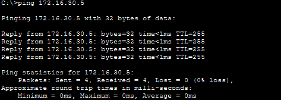
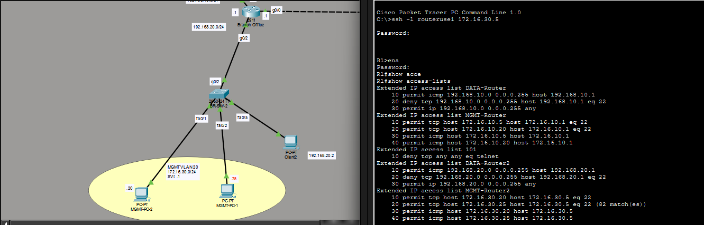
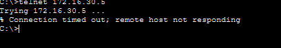
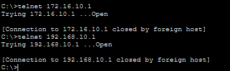
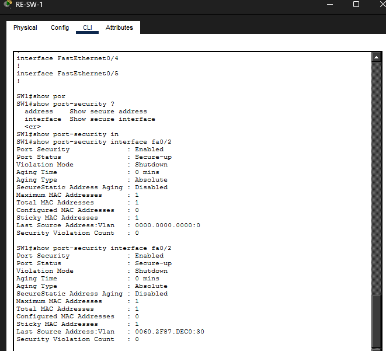
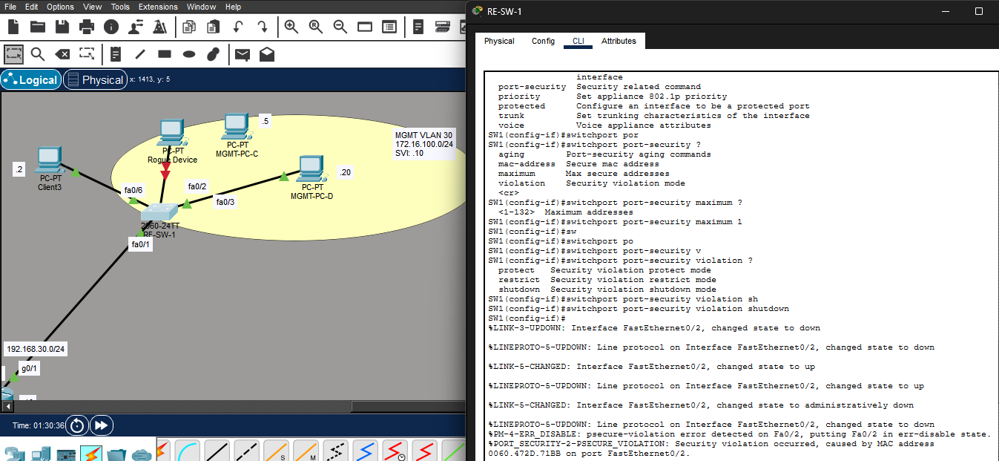

# Lab Objective

This lab is part of a multi-phase enterprise network simulation. The goal is to implement access controls that:
<ul>
<li>Restrict management access to authorized devices only</li>
<li>Prevent unauthorized devices from connecting to the network</li>
<li>Control traffic flow between data and management subnets</li>
</ul>
The lab simulates two network-connected sites - a branch office and a remote office - with routers and access switches. The login information for switches and routers remain the same.

# Network Design
Each site includes:
<ul>
<li>1 router</li>
<ul>
<li>Each router has subinterfaces, allowing PCs in the Management VLAN to perform SSH operations</li></ul>
<li>2 access switches</li>
<li>3 PCs</li>
<ul>
<li>2 PCs are in each Management VLAN</li>
<li>1 PC is in Data VLAN</li>
</ul>
</ul>

## VLAN Structure
<ul>
<li>Management VLAN</li>
<ul>
<li>Used for SSH access to routers</li>
</ul>
<li>Data VLAN</li>
<ul>
<li>Used for regular client communication</li>
</ul>
<li>Native VLAN</li>
<ul>
<li>Temporary setup for client communication, but will be changed in future labs</li>
</ul>
</ul>

# Security Configuration
The console passwords for the switches have been replaced with a username and password. See updated credentials on the topology. 

## Access Control Lists
Access control lists are configured on both the branch and remote routers to enforce the following design goals.

### Access Control List Design Goals
<ul>
<li>Allow Management PCs to:</li>
<ul>
  <li>Reach their default gateway</li>
  <li>Access routers via SSH, and not Telnet</li>
</ul>
<li>Allow Data PCs:</li>
<ul>
<li>Reach their gateway</li>
<li>Communicate with other data devices and Internet (future lab)</li>
</ul>
<li>Deny:</li>
<ul>
<li>Management VLAN to Data VLAN access</li>
<li>Data VLAN to SSH access to routers</li>
<li>All Telnet traffic</li>
</ul>
</ul>

<pre><code>Extended IP access list DATA-Router
    10 permit icmp 192.168.10.0 0.0.0.255 host 192.168.10.1
    20 deny tcp 192.168.10.0 0.0.0.255 host 192.168.10.1 eq 22
    30 permit ip 192.168.10.0 0.0.0.255 any
Extended IP access list MGMT-Router
    10 permit tcp host 172.16.10.5 host 172.16.10.1 eq 22
    20 permit tcp host 172.16.10.20 host 172.16.10.1 eq 22
    30 permit icmp host 172.16.10.5 host 172.16.10.1
    40 permit icmp host 172.16.10.20 host 172.16.10.1
Extended IP access list 101
    10 deny tcp any any eq telnet
</code></pre>

Use <code>show running-config</code> or <code>show access-lists</code> on either router to see the full access control lists. 

## Port Security
Port security is configured on access switch ports connected to PCs to prevent unauthorized device access. 
### Port Security Configuration Guidelines
<ul>
<li>Any unused ports must be administratively shutdown by using:
  <pre><code>conf t
  int {interface}
  shutdown</code></pre></li>
<li>Port security is enabled on access switch ports connected to client or management PCs</li>
<li>There is no port security enabled on trunk links between the switch and router. </li>
<li>Each port should limit to one configured MAC address</li>
<pre><code>conf t
int {interface}
switchport port-security
switchport port-security mac-address sticky</code></pre>
</ul>

To verify the MAC address on the interface, ping the default gateway to verify connectivity. Once verified, use <code>show run</code>. 

# Network Configuration
## Trunk Lines
Trunk lines are used to carry Management VLAN and Data VLAN traffic between the access switch and router. This allows multiple VLANs to traverse a single physical link. All trunk lines use 802.1q encapsulation. 

The network currently uses VLAN 1 as the native VLAN. <b>This is a temporary solution to demonstrate connectivity. The lab will implement more VLANs, so data traffic will be moved across those VLANs.</b>
<pre><code>interface FastEthernet0/1
 switchport trunk allowed vlan 1,10
 switchport mode trunk
 switchport nonegotiate
</code></pre>

## Router Subinterface Configuration
Each site includes a Management VLAN mapped to a router subinterface. The Management VLAN is configured with a subinterface to allow SSH access and ICMP attempts to verify connectivity. 

<pre><code>conf t
interface GigabitEthernet0/1.10
 encapsulation dot1Q 10
 ip address 172.16.10.1 255.255.255.0
 ip access-group MGMT-Router in</code></pre>

This step is important to ensure the intended rules in the access control lists operate as intended. If implemented on the interface, unintended traffic may pass. To see the full router subinterface configurations, use <code>show run</code>. 

# Verification

## Management VLAN Connectivity

The Management VLAN was tested to confirm that authorized hosts can successfully communicate with the router and perform secure management operations.

**Successful Connectivity**
- Management PCs can ping the default gateway  
- Management PCs can establish SSH sessions to the router  

**Security Enforcement**
- Telnet access is blocked, ensuring only secure remote access (SSH) is permitted  

### Data VLAN Connectivity

The Data VLAN was tested to ensure that user devices are restricted from performing management actions.

**Restricted Access**
- Data PCs are unable to initiate Telnet sessions  
- Data PCs are prevented from accessing management services on the router  

### Port Security Verification

Port security was configured on access ports to prevent unauthorized devices from connecting to the network.

**Security Features Confirmed**
- Sticky MAC address learning is enabled  
- Each port is limited to a single MAC address  
- Only authorized devices are allowed to connect  

## Summary

The verification process confirms that:

- Management devices can securely access the router using SSH  
- Data devices are restricted from management access  
- Telnet is fully blocked across the network  
- Port security prevents unauthorized device connections  

These results demonstrate that access control policies and Layer 2 security mechanisms are functioning as intended.
 
